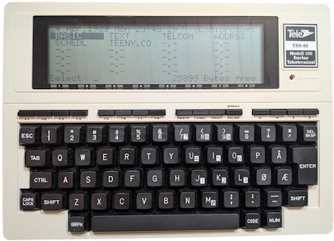
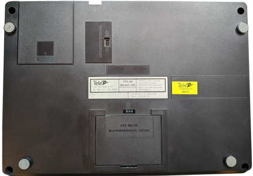
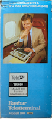
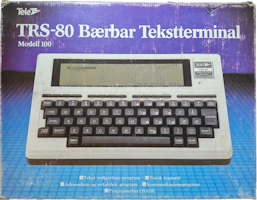
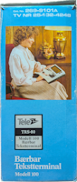
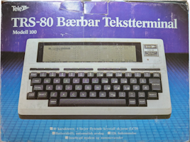
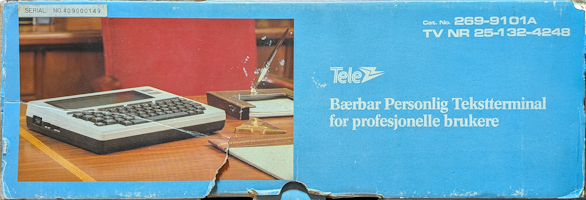
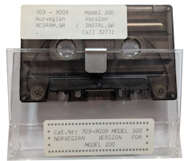

# The Norwegian TRS80 Model 100

<table>
  <tr>
    <td>
        <a href="IMAGES/Unit_Front.png" target="_blank" rel="noopener noreferrer">
            
        </a>
    </td>
    <td>
        <a href="IMAGES/Unit_Back.png" target="_blank" rel="noopener noreferrer">
            
        </a>
    </td>
  </tr>
</table>

As you can see we could buy a real Norwegian versions of the TRS-80 Model 100 back in the day! All with the beautiful ÆØÅ characters and also being able to input the date in our native toung as DD/MM/YY. The logo **Tele** was the logo of our national phone company Televerket in the 80's.

As I was working on and documenting my simple program [M100Link](https://github.com/Warshi7819/M100Link) for transfering files to and from it I also learned that there is still quite the interest for these small machines and also the different nationalized versions. In this repository I will therefore try to store what I have learned/documented about my Norwegian: **Tele - Modell 100 - Bærbar Tekstterminal**. Which translates to: Tele - Model 100 - Portable Text Terminal. 

## Norwegian Pamphlet
This pamphlet in Norwegian was included with the unit. It's basically a Quick Start Guide that explains the most important functions.  

<table>
  <!-- Row 1 -->
  <tr>
    <th>
        <a href="IMAGES/Pamphlet 01.png" target="_blank" rel="noopener noreferrer">
            
        </a>
    </th>
    <th>
        <a href="IMAGES/Pamphlet 02.png" target="_blank" rel="noopener noreferrer">
            
        </a>
    </th>
    <th>
        <a href="IMAGES/Pamphlet 03.png" target="_blank" rel="noopener noreferrer">
            
        </a>
    </th>
    <th>
        <a href="IMAGES/Pamphlet 04.png" target="_blank" rel="noopener noreferrer">
            
        </a>
    </th>
    <th>
        <a href="IMAGES/Pamphlet 05.png" target="_blank" rel="noopener noreferrer">
            
        </a>
    </th>
  </tr>
  <!-- Row 2 -->
  <tr>
    <td>
        <a href="IMAGES/Pamphlet 06.png" target="_blank" rel="noopener noreferrer">
            
        </a>
    </td>
    <td>
        <a href="IMAGES/Pamphlet 07.png" target="_blank" rel="noopener noreferrer">
            
        </a>
    </td>
    <td>
        <a href="IMAGES/Pamphlet 08.png" target="_blank" rel="noopener noreferrer">
            
        </a>
    </td>
    <td>
        <a href="IMAGES/Pamphlet 09.png" target="_blank" rel="noopener noreferrer">
            
        </a>
    </td>
    <td>
        <a href="IMAGES/Pamphlet 10.png" target="_blank" rel="noopener noreferrer">
            
        </a>
    </td>
  </tr>
</table>

## Packaging
The box itself is also nationalized and you can see that it's the Norwegian TRS-80 model 100 that is depict on the front and back. Also, all text is in Norwegian.

<table>
  <tr>
    <td>
        <a href="IMAGES/Box_Left.png" target="_blank" rel="noopener noreferrer">
            
        </a>
      <br/>
      <center>Left Side</center>
    </td>
    <td>
        <a href="IMAGES/Box_Front.png" target="_blank" rel="noopener noreferrer">
            
        </a>
      <br/>
      <center>Front</center>
    </td>
    <td>
        <a href="IMAGES/Box_Right.png" target="_blank" rel="noopener noreferrer">
            
        </a>
      <br/>
      <center>Right Side</center>
    </td>
    <td>
        <a href="IMAGES/Box_Back.png" target="_blank" rel="noopener noreferrer">
            
        </a>
      <br/>
      <center>Back</center>
    </td>
  </tr>
  <tr>
    <td colspan="4">
        <a href="IMAGES/Box_Top.png" target="_blank" rel="noopener noreferrer">
            
        </a>
      <br/>
      <center>Top</center>
    </td>
  </tr>
</table>

> [!NOTE]
> The bottom of the box had the same light blue colour as the rest of the box. Nothing else.

## What Was Included?
In addition to the unit itself, the following was present in the box:
* The Norwegian Get Started Guide (Pamphlet)
* The TRS-80 Model 100 Quick Reference Guide (English language) - [Available Here](https://manx-docs.org/mirror/harte/Radio%20Shack/TRS-80%20Model%20100%20Quick%20Reference%20Guide.pdf)
* The full TRS-80 Model 100 Manual from Radio Shack (English language) - [Available Here](https://archive.org/details/trs-80-m-100-user-guide)
* The needed cables to hook it up to the phone line of the time
* A Cassette - See section below.

> [!NOTE]
> Although it seems like the unit is complete in box I have to state that I bought this second hand. Thus there might have been more included from the factory back in the day. One thing I would like to have had included is the cable for a cassette deck. Luckily the [brick of a manual](https://archive.org/details/trs-80-m-100-user-guide/page/206/mode/2up) from RadioShack also details the pinout for the cassette plug. It should therefore be easy enough to either verify that it's the same as my TRS-80 CoCo machine or at the very least enable me to build one.  

## The Cassette
<a href="IMAGES/Cassette.png" target="_blank" rel="noopener noreferrer">
    
</a>

Page 9 and 10 of the pamphlet above tells the story behind the cassette. 

### Program To Choose Character Set
To use Norwegian or English character set (ASCII-code) you will have to load the programs RESRAM and INSTAL. 

**Note:** RESRAM deletes existing programs and at the same time reserves 512 bytes for INSTAL. 

Attach the cassette player and load the RESRAM cassette. Go to BASIC and type: CLOAD [ENTER]

After the RESRAM program is loaded, stop the cassette player. Press F4 (Run). Go to BASIC again and type: CLOAD [ENTER]. Now the INSTAL program is loaded. Press F4 (Run). 

Daily use:

Go to BASIC and type CALL 32771 [ENTER]

The following menu will be presented:

<a href="IMAGES/charset menu.png" target="_blank" rel="noopener noreferrer">
    
</a>

> [!NOTE]
> Translated to English the program menu says:
> 
> Definition of Character Set
>
> **1:** Norwegian Telecom   **2:** English Telecom
>
> **3:** Norwegian Printer   **4:** English Printer
>
> **4:** CR & LF             **5:** CR
>
> **F8:** Menu
>
> Please input choice

> [!NOTE]
> I have managed to dump the cassette and translate it back to the BASIC listings.
> 
> RESRAM can be found here: (<a href="CASSETTE/resram.ba" target="_blank" rel="noopener noreferrer">original</a>, <a href="CASSETTE/resram_english.ba" target="_blank" rel="noopener noreferrer">english translation</a>)
>
> INSTAL can be found here: (<a href="CASSETTE/install.ba" target="_blank" rel="noopener noreferrer">original</a>, <a href="CASSETTE/install_english.ba" target="_blank" rel="noopener noreferrer">english translation</a>)
>
> Thanks to Clinton and B9 over at the M100 mailing list! 

## The Missing Chars
Turns out that there is another difference between this Norwegian unit and those sold in the US. Char 224 up until and including char 254 are blank! On the units sold in America these sequence of chars contains different shapes (drawing characters):

<a href="CHAR%20DIFFERENCE/en_chars.png" target="_blank" rel="noopener noreferrer">
    
</a>

Whereas on the Norwegian unit they are completely blank:

<a href="CHAR%20DIFFERENCE/no_chars.png" target="_blank" rel="noopener noreferrer">
    
</a>

There are quite a few drawing characters left though between 128 and 224 but missing these 30 chars will of course impact programs that use them. And I actually immediatly ran into this problem as one of the first games I tried was FROGER on the M100. The top line is supposed to have open slots where you are going to park the frog once you have crossed the river/road. This is how the parking spots looks like on an US unit:

<a href="CHAR%20DIFFERENCE/en_frogger.png" target="_blank" rel="noopener noreferrer">
    
</a>

The top line is drawn with a combination of chr(239) which is a solid block and spaces for where you should park Mr. Froggy. And yeah, I'm sure you have discovered the problem. On the Norwegian unit both chr(239) and space is blank so the entire top line is just continouse blanks:

<a href="CHAR%20DIFFERENCE/no_frogger.png" target="_blank" rel="noopener noreferrer">
    
</a>

This makes it a bit tough to play the game as the parking spots are not visible anymore. Unless you go into the BASIC script and replace all the occurances of chr(239) to for instance chr(255) that is. Chr(255) is a different block drawing char that works well also on the Norwegain unit!

<a href="CHAR%20DIFFERENCE/no_frogger_fixed.png" target="_blank" rel="noopener noreferrer">
    
</a>


## ROM Dump
With the help of the people on the [M100 maling](http://lists.bitchin100.com/listinfo.cgi/m100-bitchin100.com) list I finally got my hands on a working script that outputs the entire ROM as a comma seperated list of bytes (0-255) over serial. The script (RDUMP.DO), the raw output (raw_output.txt) of the script and the hexified version (hex_version.txt) is available in the ROM folder. The hexified version was created by myself by reading each byte value into a python script and then outputing each byte value as hex pairs using the following conversion: **format(int(value), '02X')**.

The user B9 then helped me to convert the hex file to a rom file using the unix command **xxd -r -p  < output_hex.txt  > m100.norway.rom**. The resulting rom file (m100.norway.rom) can also be found in the ROM folder of this repository. 

```
10 REM ROM Dump Utility by Clinton Reddekop (January 2026)
20 REM    Dumps the contents of main ROM over serial
100 open "com:58N1E" for output as 1
120 sum=0
140 for a=0to32767
160 b=peek(a)
180 print #1,b;","
200 sum=sum+b
220 if sum>8192 then sum=sum-8192
240 next a
260 print #1,"sum=";sum
280 end
```
The script probably took close to 30 minutes to complete at 1200 bauds over serial. But I had to run it slow to ensure I didn't loose data during transfer. 

## VERSION INFO
<table>
  <tr>
    <td><b>Model</b></td>
    <td>TRS-80 Modell 100</td>
    <td><b>Serial NO</b></td>
    <td>409000149</td>
  </tr>
  <tr>
    <td><b>CAT NO</b></td>
    <td>269-9101</td>
    <td><b>TV NR</b></td>
    <td>25-132-4248</td>
  </tr>
  <tr>
    <td colspan="2"><b>Tillatelse nr.</b></td>
    <td colspan="2">84/015</td>
  </tr>  
</table>

**CUSTOM MFD. IN JAPAN FOR TANDY CORPORATION**

> [!NOTE]
> "Tillatelse nr." translates to Permit number. The number suggest that the permit was secured in 1984.

## IMAGES
I used the [PerspectiveFix](https://oathanrex.github.io/perspective-fix/) free online tool to straighten out the images of the pamphlet and the box. The original images are there as well if I at some point find a better free tool. But quite happy with the results!
